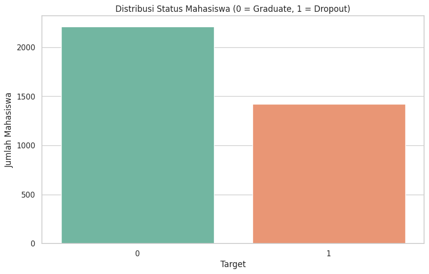
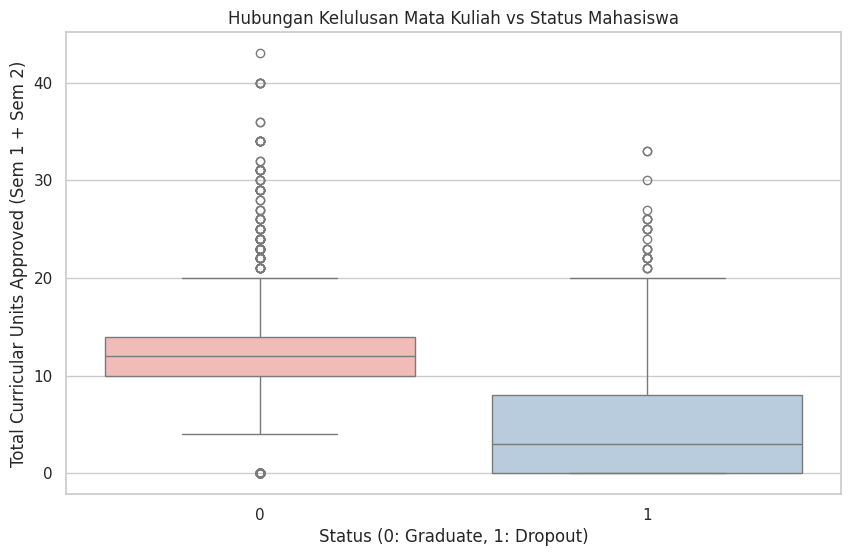
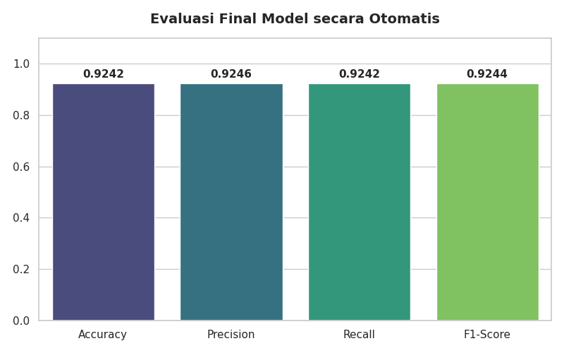
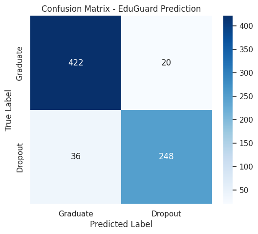
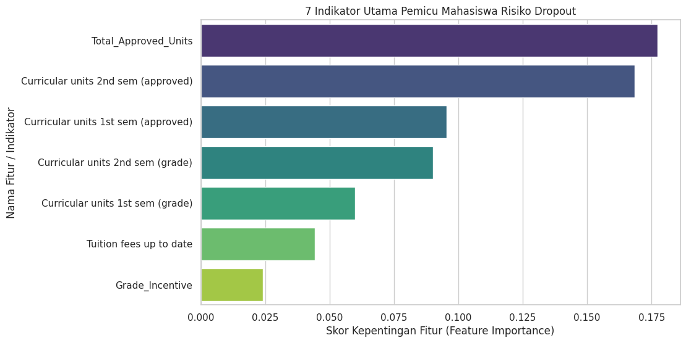
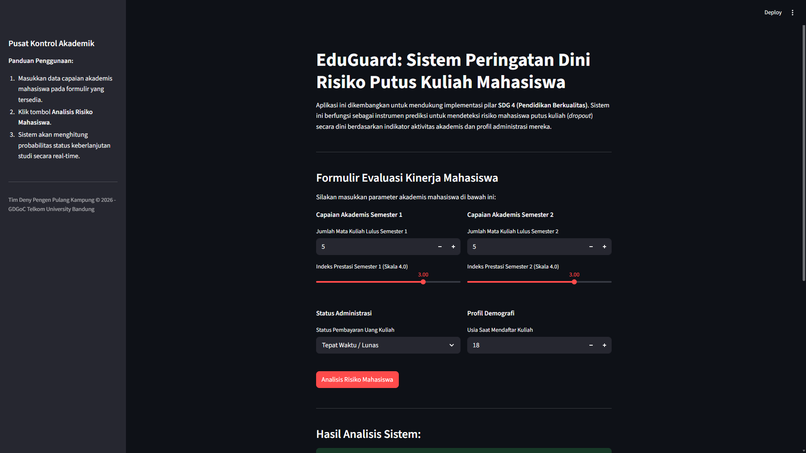
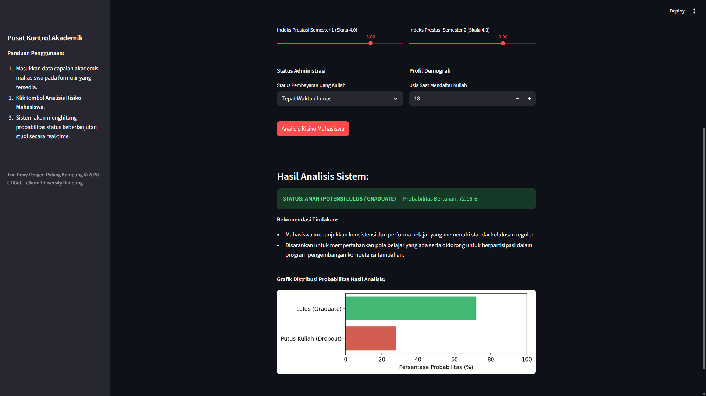

# 🎓 EduGuard: Student Dropout Early Warning System

> Leveraging Machine Learning to Support SDG 4: Quality Education Through Early Student Dropout Risk Detection

---

# 📖 Tentang Proyek

**EduGuard** merupakan sistem peringatan dini (*Early Warning System*) berbasis Machine Learning yang dirancang untuk membantu institusi pendidikan dalam mengidentifikasi mahasiswa yang berpotensi mengalami putus kuliah (*dropout*) sejak tahap awal masa studi.

Dengan memanfaatkan data akademik, administratif, dan demografis mahasiswa, sistem ini mampu menghasilkan prediksi risiko dropout beserta tingkat probabilitasnya sehingga pihak kampus dapat melakukan intervensi lebih cepat dan lebih tepat sasaran.

Proyek ini dikembangkan sebagai **Final Project Machine Learning** dalam program **Google Developer Groups on Campus (GDGoC) Telkom University 2026**.

---

# 🌍 Sustainable Development Goals (SDGs)

## SDG 4: Quality Education

Pendidikan berkualitas merupakan salah satu fondasi utama pembangunan berkelanjutan. Namun, tingginya angka mahasiswa yang gagal menyelesaikan pendidikan masih menjadi tantangan bagi berbagai institusi pendidikan tinggi di seluruh dunia.

Melalui EduGuard, kami berupaya mendukung implementasi **SDG 4: Quality Education** dengan memanfaatkan teknologi Artificial Intelligence dan Machine Learning untuk membantu proses identifikasi risiko dropout mahasiswa secara lebih cepat, objektif, dan berbasis data.

Dengan adanya sistem ini, institusi pendidikan dapat mengambil tindakan preventif lebih awal, meningkatkan retensi mahasiswa, serta memberikan dukungan akademik yang lebih efektif kepada mahasiswa yang membutuhkan.

---

# 🎯 Tujuan Proyek

- Mengidentifikasi mahasiswa yang berisiko mengalami dropout.
- Membantu dosen wali dan pihak akademik dalam proses monitoring mahasiswa.
- Mendukung pengambilan keputusan berbasis data.
- Meningkatkan tingkat keberhasilan studi mahasiswa.
- Mendukung implementasi SDG 4 melalui teknologi Artificial Intelligence.

---

# 👥 Tim Pengembang

## Tim Deny Pengen Pulang Kampung

| Nama |
|--------|
| Guidomelvin |
| Deny Pratama Sukardi |
| Berto Jdoyvan Purba |
| Almer Fakhir Arwonio |

---

# 📚 Dataset

### Students Dropout and Academic Success Dataset

Dataset yang digunakan berasal dari UCI Machine Learning Repository:

https://archive.ics.uci.edu/dataset/697/predict+students+dropout+and+academic+success

Dataset ini berisi berbagai informasi akademik, administratif, dan demografis mahasiswa yang digunakan untuk memprediksi kemungkinan mahasiswa berhasil lulus ataupun mengalami dropout.

Informasi yang tersedia dalam dataset meliputi:

- Data demografi mahasiswa
- Status administrasi
- Riwayat akademik
- Performa semester awal
- Status akhir mahasiswa

---

# 🔍 Data Preprocessing

Tahapan preprocessing yang dilakukan meliputi:

### 1. Data Loading & Exploration

- Memuat dataset menggunakan Pandas
- Pemeriksaan struktur data
- Analisis distribusi data
- Identifikasi fitur dan target

### 2. Data Cleaning

- Pemeriksaan missing values
- Pemeriksaan data duplikat
- Validasi konsistensi data

### 3. Feature Engineering

Fitur tambahan yang dibuat untuk meningkatkan performa model:

#### Total_Approved_Units

Jumlah total mata kuliah yang berhasil diselesaikan mahasiswa pada semester pertama dan semester kedua.

#### Grade_Incentive

Perubahan performa akademik mahasiswa dari semester pertama ke semester kedua.

### 4. Feature Selection

Pemilihan fitur yang paling relevan terhadap target prediksi.

### 5. Feature Scaling

Standarisasi fitur numerik menggunakan StandardScaler untuk menjaga konsistensi data selama proses pelatihan dan prediksi.

### 6. Train-Test Split

Dataset dibagi menjadi data training dan data testing untuk memastikan proses evaluasi model dilakukan secara objektif.

---

# 📊 Exploratory Data Analysis (EDA)

Sebelum proses pelatihan model dilakukan, Exploratory Data Analysis (EDA) digunakan untuk memahami karakteristik dataset, distribusi target, serta hubungan antar fitur yang berpotensi memengaruhi risiko dropout mahasiswa.

## Distribusi Status Mahasiswa

Visualisasi berikut menunjukkan distribusi mahasiswa berdasarkan status akhirnya pada dataset.

- **Graduate (0)** → Mahasiswa yang berhasil menyelesaikan studi.
- **Dropout (1)** → Mahasiswa yang tidak menyelesaikan studi.

<p align="center">
  
</p>

Hasil analisis menunjukkan bahwa jumlah mahasiswa yang berhasil lulus lebih banyak dibandingkan mahasiswa yang mengalami dropout. Distribusi ini tetap cukup representatif untuk membangun model klasifikasi yang mampu membedakan kedua kelompok mahasiswa.

---

## Hubungan Kelulusan Mata Kuliah dengan Status Mahasiswa

Visualisasi berikut menunjukkan hubungan antara jumlah mata kuliah yang berhasil diselesaikan mahasiswa pada dua semester awal dengan status akhir studinya.

<p align="center">
  
</p>

Terlihat bahwa mahasiswa yang berhasil lulus cenderung memiliki jumlah mata kuliah lulus yang lebih tinggi dibandingkan mahasiswa yang mengalami dropout. Temuan ini mengindikasikan bahwa performa akademik pada semester awal merupakan salah satu indikator penting dalam menentukan keberhasilan studi mahasiswa.

---

# 🤖 Model Machine Learning

Model utama yang digunakan pada proyek ini adalah:

## Random Forest Classifier

Alasan pemilihan model:

- Memiliki performa yang baik pada data tabular.
- Mampu menangani hubungan non-linear antar fitur.
- Tidak terlalu sensitif terhadap outlier.
- Stabil terhadap variasi data.
- Dapat memberikan informasi Feature Importance untuk interpretasi model.

Model yang telah dilatih kemudian disimpan menggunakan Joblib dan digunakan kembali pada aplikasi Streamlit.

---

# 📊 Evaluasi Model

Setelah proses pelatihan selesai, model dievaluasi menggunakan data pengujian untuk mengukur kemampuannya dalam memprediksi risiko dropout mahasiswa.

## Hasil Evaluasi Model

Visualisasi berikut menunjukkan hasil evaluasi model menggunakan metrik klasifikasi seperti Accuracy, Precision, Recall, dan F1-Score.

<p align="center">
  
</p>

Model menunjukkan performa yang sangat baik dalam membedakan mahasiswa yang berpotensi lulus dan mahasiswa yang berpotensi mengalami dropout.

---

## Confusion Matrix

Confusion Matrix digunakan untuk mengevaluasi kemampuan model dalam melakukan klasifikasi terhadap data pengujian.

<p align="center">
  
</p>

Berdasarkan hasil pengujian:

- 422 mahasiswa Graduate berhasil diprediksi dengan benar.
- 248 mahasiswa Dropout berhasil diprediksi dengan benar.
- 20 mahasiswa Graduate salah diprediksi sebagai Dropout.
- 36 mahasiswa Dropout salah diprediksi sebagai Graduate.

Hasil tersebut menunjukkan bahwa model memiliki kemampuan klasifikasi yang baik dengan tingkat kesalahan yang relatif rendah.

---

## Feature Importance

Untuk meningkatkan interpretabilitas model, dilakukan analisis Feature Importance guna mengetahui faktor-faktor yang paling berpengaruh terhadap prediksi risiko dropout mahasiswa.

<p align="center">
  
</p>

### Insight Utama

Berdasarkan hasil Feature Importance, faktor yang paling memengaruhi prediksi risiko dropout mahasiswa adalah:

1. Total_Approved_Units
2. Curricular Units 2nd Semester (Approved)
3. Curricular Units 1st Semester (Approved)
4. Curricular Units 2nd Semester (Grade)
5. Curricular Units 1st Semester (Grade)
6. Tuition Fees Up To Date
7. Grade Incentive

Temuan ini menunjukkan bahwa performa akademik mahasiswa pada dua semester pertama merupakan indikator paling penting dalam menentukan keberlanjutan studi mahasiswa.

---

# 🖥️ Aplikasi Streamlit

EduGuard dikembangkan menggunakan Streamlit untuk menyediakan antarmuka yang sederhana, intuitif, dan mudah digunakan.

Fitur utama aplikasi:

- Input data mahasiswa secara interaktif.
- Prediksi risiko dropout secara real-time.
- Perhitungan probabilitas hasil prediksi.
- Visualisasi probabilitas Graduate dan Dropout.
- Rekomendasi tindak lanjut akademik.
- Dashboard yang mudah digunakan oleh pengguna non-teknis.

---

## Dashboard Utama

Dashboard utama menyediakan formulir evaluasi mahasiswa yang memungkinkan pengguna memasukkan informasi akademik dan administratif untuk dilakukan analisis risiko dropout secara real-time.

<p align="center">
  
</p>

---

## Prediksi Mahasiswa Aman

Contoh hasil prediksi ketika mahasiswa memiliki performa akademik yang baik dan berpotensi menyelesaikan studi dengan sukses.

<p align="center">
  
</p>

---

## Prediksi Mahasiswa Berisiko Dropout

Contoh hasil prediksi ketika mahasiswa menunjukkan indikator yang mengarah pada risiko dropout sehingga memerlukan perhatian dan pendampingan akademik lebih lanjut.

<p align="center">
  
</p>

---

# 📂 Struktur Repository

```text
EduGuard/
│
├── EduGuard.ipynb
├── app.py
├── data.csv
├── model_dropout.pkl
├── scaler_dropout.pkl
├── selected_features.pkl
├── README.md
└── images/
    ├── dashboard.png
    ├── prediction-safe.png
    ├── prediction-dropout.png
    ├── target-distribution.png
    ├── approved-units-analysis.png
    ├── model-evaluation.png
    ├── confusion-matrix.png
    └── feature-importance.png
```

---

# 🛠️ Tech Stack

### Programming Language

- Python

### Machine Learning

- Scikit-Learn

### Data Processing

- Pandas
- NumPy

### Data Visualization

- Matplotlib
- Seaborn

### Web Deployment

- Streamlit

### Model Persistence

- Joblib

---

# 🤖 Deklarasi Penggunaan AI

Pengembangan proyek ini memanfaatkan bantuan Artificial Intelligence (AI) sebagai alat pendukung pembelajaran dan pengembangan perangkat lunak.

Tools yang digunakan:

- Google Gemini
- ChatGPT

AI digunakan untuk membantu proses:

- Brainstorming ide dan solusi.
- Pengembangan kode Python.
- Debugging dan optimasi kode.
- Pengembangan antarmuka Streamlit.
- Dokumentasi dan penyusunan README.

Seluruh anggota tim tetap memahami, memverifikasi, dan bertanggung jawab atas seluruh implementasi yang digunakan dalam proyek ini sesuai dengan ketentuan Final Project Machine Learning GDGoC Telkom University 2026.

---

# 🚀 Cara Menjalankan Proyek

## 1. Clone Repository

```bash
git clone https://github.com/username/EduGuard.git
cd EduGuard
```

## 2. Install Library yang Dibutuhkan

```bash
pip install streamlit pandas numpy scikit-learn matplotlib seaborn joblib
```

## 3. Jalankan Aplikasi

```bash
streamlit run app.py
```

## 4. Akses Melalui Browser

```text
http://localhost:8501
```

---

# 🌟 Dampak yang Diharapkan

Melalui EduGuard, kami berharap institusi pendidikan dapat:

- Mengurangi angka dropout mahasiswa.
- Meningkatkan tingkat retensi mahasiswa.
- Mendukung pengambilan keputusan berbasis data.
- Memberikan intervensi akademik yang lebih efektif.
- Berkontribusi terhadap pencapaian SDG 4: Quality Education.

---

# 🎓 Program

Final Project Machine Learning

Google Developer Groups on Campus (GDGoC)

Telkom University 2026

---

# 📜 Lisensi

Proyek ini dikembangkan untuk tujuan pendidikan, pembelajaran, dan pengembangan kompetensi Machine Learning dalam program Google Developer Groups on Campus (GDGoC) Telkom University 2026.
